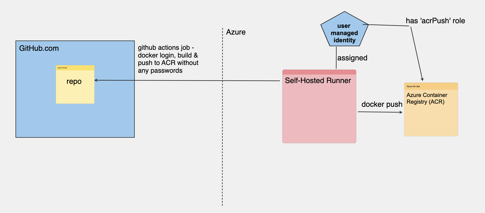

# runner-acr-login-action

The goal of this custom GitHub Action is to be able to login to Azure Container Registry with associated user managed identity of the self-hosted runner removing the need to keep any passwords on the GitHub side.

## GitHub Action flow


## Usage

```yaml

on:
  # Allows you to run this workflow manually from the Actions tab
  workflow_dispatch:
    inputs:
      acr_uri:
        type: string
        description: "ACR name"
        default: "acrname.azurecr.io"
      client_id:
        type: string
        description: "Client ID (in case of multiple managed identity)"
        default: ""
      tenant_id:
        type: string
        description: "tenant id"
        default: ""
jobs:
  self_hosted_acr_job:
    runs-on: self-hosted
    name: Build and Push to ACR
    steps:
      - name: Checkout Code
        uses: actions/checkout@v3
      - name: ACR login
        id: acrlogin
        uses: yaronpri/runner-acr-login-action@main
        with:
          acr_uri: ${{ github.event.inputs.acr_uri }}
          client_id: ${{ github.event.inputs.client_id }}
          tenant_id: ${{ github.event.inputs.tenant_id }}      
      - name: Docker build
        run: docker build -t ${{ github.event.inputs.acr_uri }}/${{ env.IMAGE_NAME}}:${{ github.sha }} .
      - name: Docker push
        run: docker push ${{ github.event.inputs.acr_uri }}/${{ env.IMAGE_NAME}}:${{ github.sha }}
```

## Configuration

You can configure the action with various inputs, a list of which has been provided below:

| Name             | Description                                                                                     | Default Value |
|------------------|-------------------------------------------------------------------------------------------------|---------------|
| acr_uri     | (Mandatory) The Azure Container Registy URI (the user managed identity should have AcrPull/AcrPush role)                 | ''        |
| client_id   | (optional) The User Managed Identity Client Id (in case of multiple managed identity assigned to self-hosted runner vm, machine)                                                              | ''        |
| tenant_id       |  (optional) The tenant id                                                            | ''           |


## GitHub Runner self-hosted on Kubernetes
This custom GitHub Action can enhanced [this](https://github.com/Azure-Samples/github-runner-on-aks) Azure Sample to use Managed Identity which assigned to AKS